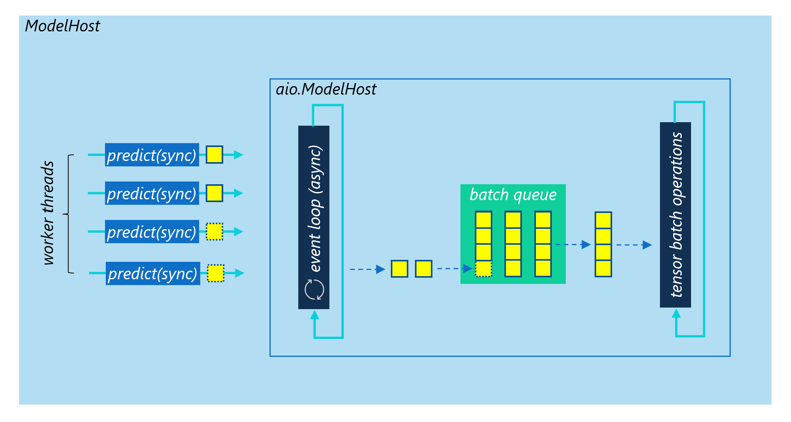
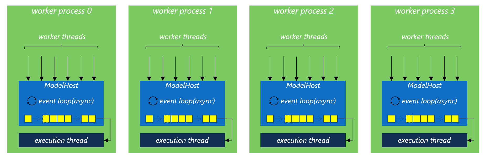

==========================
Local Mode (ModelHost)
==========================

  The ModelHost and aio.ModelHost classes

Multi-Thread Workers
==========================

To reach `max_batch_size`, you need to create at least the same `num_threads` as `max_batch_size`. For example, if the max batch size is 8, you need to create at least 8 worker threads. Otherwise, max batch size could never be reached.

  ModelHost with Multi-Process + Multi-Thread Workers

AsyncIO Workers
==========================

Too many threads might be a performance bottleneck for you. For example, if you want the max batch size to be 1024, you need at least 1024 threads to support it. This won't a good idea especially when the model inference time is small and Python GIL overhead can't be ignored.

In this case, you should use the async version of model host `aio.ModelHost` implemented by Python AsyncIO instead, which has the same APIs as `ModelHost`. Meanwhile, you should also consider to use an async worker in your web server, for example the `uvicorn <https://www.uvicorn.org/>`__ async worker.

Multi-Process Workers
==========================

When a significant amount of the system latency is contributed by pure Python code, such as pre-prcessing or post-processing, instead of model inference, multiple worker processes should be created to avoid the side effect of Python GIL. In this way, each process maintains its own `ModelHost` instance and handles requests separately. If you use Gunicorn to serve the model, the default `synchronous workers <https://docs.gunicorn.org/en/stable/design.html#sync-workers>`__ are the corresponding choice here. The reason is that machine learning workload is alomost CPU-bound. To make the most efficient use of the CPU cores, you should create as many worker processes as `(2 x $num_cores) + 1`. This is the suggested setting of Gunicorn. Meanwhile, you need to consider the thread pool managed by the deep learning frameworks as well, such as PyTorch, ONNXRuntime or TensorFlow.

..  code-block:: bash

    gunicorn --workers=5 main:app

As discussed in previous section, you can still create multiple threads inside each worker process to help each work process reach the max batch size. If you use Gunicorn to serve the model, choose the sync worker type and set the threads setting to more than 1, the `gthread workers <https://docs.gunicorn.org/en/stable/design.html#asyncio-workers>`__ type will be used. In this case, the Python application is loaded once per worker process, and each of the threads spawned by the same worker process shares the same memory space.

..  code-block:: bash

    gunicorn --workers=5 --threads=2 --worker-class=gthread main:app

Although `Python AsyncIO` is supported by `aio.ModelHost`, Gunicorn only supports gevent backed async workers. Python AsyncIO and gevent might not be compatible and we don't verify that. It is not recommended to use `aio.ModelHost` with Gunicorn.
