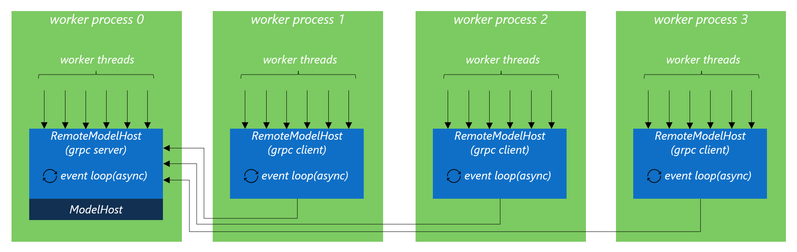

================================
Remote Mode (RemoteModelHost)
================================

Setting the number of worker processes to be `(2 x $num_cores) + 1` is perfect for running preprocessing and postprocessing code which is in Python efficient. However, if you plan to run tensor compluations on a GPU device, you will want to have only one DNN model instance created on the GPU device. In this scenario, you should use `RemoteModelHost` instead of `ModelHost`.

With `RemoteModelHost`, each worker process will still create its own `RemoteModelHost` instance. But internally, only one of the worker processes will really load the model onto GPU and start as the grpc server. All the other worker processes will be grpc clients and won't load the model. When `RemoteModelHost.predict` is called in client worker processes, the query is serialized and sent to the remote grpc server to process.

Note that you should set `num_processes * num_threads_per_process` to be `max batch size`. Otherwise, it's unable to reach max batch size.

  RemoteModelHost with Multi-Process + Multi-Thread Workers

Multiple GPU Devices
==========================

If you have many GPU cards, to make the best use of them, you will still want to create multiple model instances, with each GPU device serving one model instance. However, `RemoteModelHost` doesn't support the creation of multiple model instances on a single machine node. To reduce the implementaion complexity, it is singleton.

In this case, we recommend you to apply virtulization techniques. For example, creating multiple VMs or dockers and bind one GPU device to each of them respectively.
